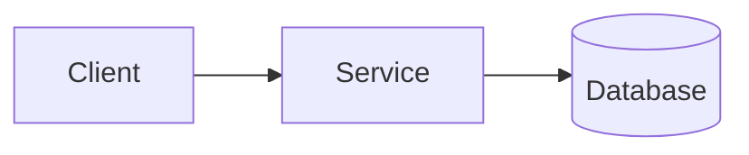

# Architecture

_TODO: high-level architecture overview, diagrams, and major components._

## Components

-

## Data Flow

```mermaid
flowchart LR
    A[Client] --> B[Service]
    B --> C[(Database)]
```

## Related

- [[Decisions]]
- [[Glossary]]
